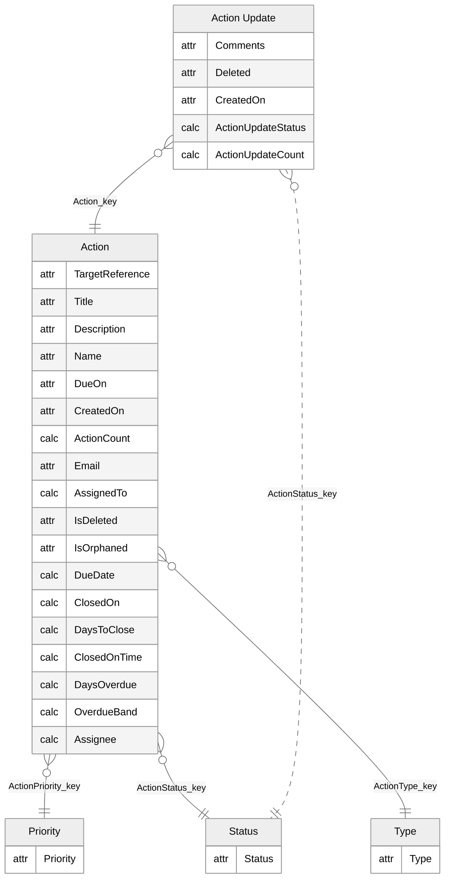
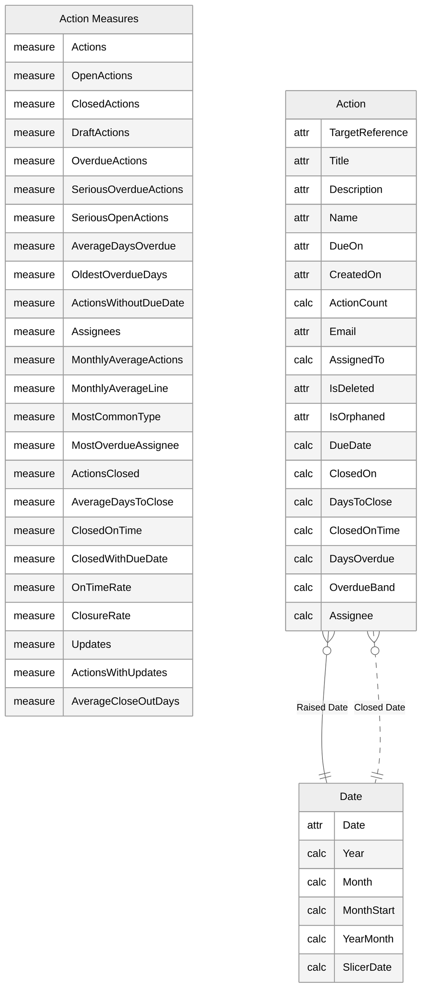

# Actions

[<- Back to index](../PowerBISamplesModels.md)

## Actions - Main

```mermaid
---
config:
  theme: neutral
---
erDiagram
    "Action" {
        attr TargetReference
        attr Title
        attr Description
        attr Name
        attr DueOn
        attr CreatedOn
        calc ActionCount
        attr Email
        calc AssignedTo
        attr IsDeleted
        attr IsOrphaned
        calc DueDate
        calc ClosedOn
        calc DaysToClose
        calc ClosedOnTime
        calc DaysOverdue
        calc OverdueBand
        calc Assignee
    }
    "Priority" {
        attr Priority
    }
    "Status" {
        attr Status
    }
    "Type" {
        attr Type
    }
    "Action Update" {
        attr Comments
        attr Deleted
        attr CreatedOn
        calc ActionUpdateStatus
        calc ActionUpdateCount
    }
    "Action" }o--|| "Priority" : "ActionPriority_key"
    "Action" }o--|| "Status" : "ActionStatus_key"
    "Action" }o--|| "Type" : "ActionType_key"
    "Action Update" }o--|| "Action" : "Action_key"
    "Action Update" }o..|| "Status" : "ActionStatus_key"
```

## Actions - Date and measures

```mermaid
---
config:
  theme: neutral
---
erDiagram
    "Date" {
        attr Date
        calc Year
        calc Month
        calc MonthStart
        calc YearMonth
        calc SlicerDate
    }
    "Action Measures" {
        measure Actions
        measure OpenActions
        measure ClosedActions
        measure DraftActions
        measure OverdueActions
        measure SeriousOverdueActions
        measure SeriousOpenActions
        measure AverageDaysOverdue
        measure OldestOverdueDays
        measure ActionsWithoutDueDate
        measure Assignees
        measure MonthlyAverageActions
        measure MonthlyAverageLine
        measure MostCommonType
        measure MostOverdueAssignee
        measure ActionsClosed
        measure AverageDaysToClose
        measure ClosedOnTime
        measure ClosedWithDueDate
        measure OnTimeRate
        measure ClosureRate
        measure Updates
        measure ActionsWithUpdates
        measure AverageCloseOutDays
    }
    "Action" {
        attr TargetReference
        attr Title
        attr Description
        attr Name
        attr DueOn
        attr CreatedOn
        calc ActionCount
        attr Email
        calc AssignedTo
        attr IsDeleted
        attr IsOrphaned
        calc DueDate
        calc ClosedOn
        calc DaysToClose
        calc ClosedOnTime
        calc DaysOverdue
        calc OverdueBand
        calc Assignee
    }
    "Action" }o--|| "Date" : "Raised Date"
    "Action" }o..|| "Date" : "Closed Date"
```
