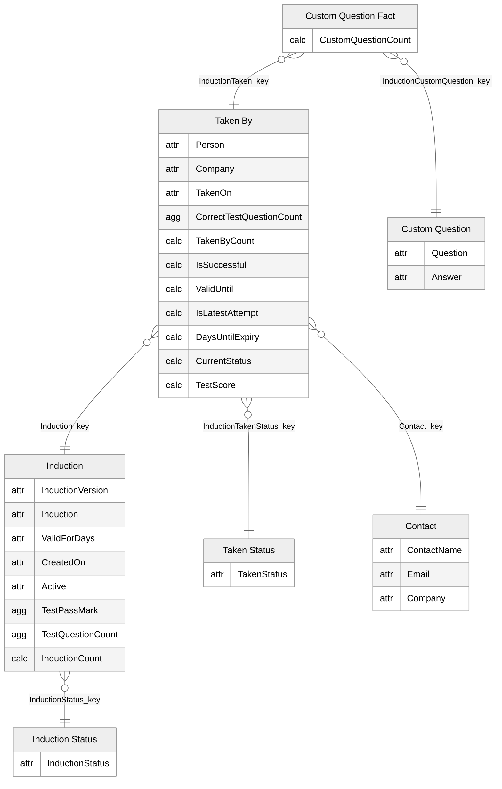
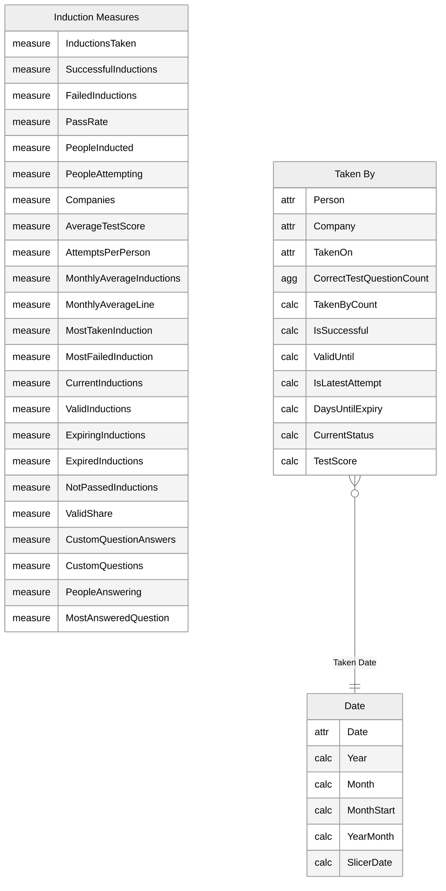

# Inductions

[<- Back to index](../PowerBISamplesModels.md)

## Inductions - Main

```mermaid
---
config:
  theme: neutral
---
erDiagram
    "Induction" {
        attr InductionVersion
        attr Induction
        attr ValidForDays
        attr CreatedOn
        attr Active
        agg TestPassMark
        agg TestQuestionCount
        calc InductionCount
    }
    "Taken By" {
        attr Person
        attr Company
        attr TakenOn
        agg CorrectTestQuestionCount
        calc TakenByCount
        calc IsSuccessful
        calc ValidUntil
        calc IsLatestAttempt
        calc DaysUntilExpiry
        calc CurrentStatus
        calc TestScore
    }
    "Taken Status" {
        attr TakenStatus
    }
    "Induction Status" {
        attr InductionStatus
    }
    "Custom Question Fact" {
        calc CustomQuestionCount
    }
    "Custom Question" {
        attr Question
        attr Answer
    }
    "Contact" {
        attr ContactName
        attr Email
        attr Company
    }
    "Induction" }o--|| "Induction Status" : "InductionStatus_key"
    "Custom Question Fact" }o--|| "Custom Question" : "InductionCustomQuestion_key"
    "Custom Question Fact" }o--|| "Taken By" : "InductionTaken_key"
    "Taken By" }o--|| "Induction" : "Induction_key"
    "Taken By" }o--|| "Taken Status" : "InductionTakenStatus_key"
    "Taken By" }o--|| "Contact" : "Contact_key"
```

## Inductions - Date and measures

```mermaid
---
config:
  theme: neutral
---
erDiagram
    "Date" {
        attr Date
        calc Year
        calc Month
        calc MonthStart
        calc YearMonth
        calc SlicerDate
    }
    "Induction Measures" {
        measure InductionsTaken
        measure SuccessfulInductions
        measure FailedInductions
        measure PassRate
        measure PeopleInducted
        measure PeopleAttempting
        measure Companies
        measure AverageTestScore
        measure AttemptsPerPerson
        measure MonthlyAverageInductions
        measure MonthlyAverageLine
        measure MostTakenInduction
        measure MostFailedInduction
        measure CurrentInductions
        measure ValidInductions
        measure ExpiringInductions
        measure ExpiredInductions
        measure NotPassedInductions
        measure ValidShare
        measure CustomQuestionAnswers
        measure CustomQuestions
        measure PeopleAnswering
        measure MostAnsweredQuestion
    }
    "Taken By" {
        attr Person
        attr Company
        attr TakenOn
        agg CorrectTestQuestionCount
        calc TakenByCount
        calc IsSuccessful
        calc ValidUntil
        calc IsLatestAttempt
        calc DaysUntilExpiry
        calc CurrentStatus
        calc TestScore
    }
    "Taken By" }o--|| "Date" : "Taken Date"
```
